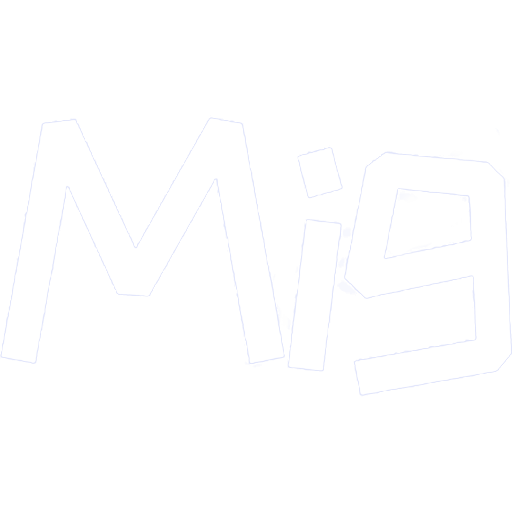
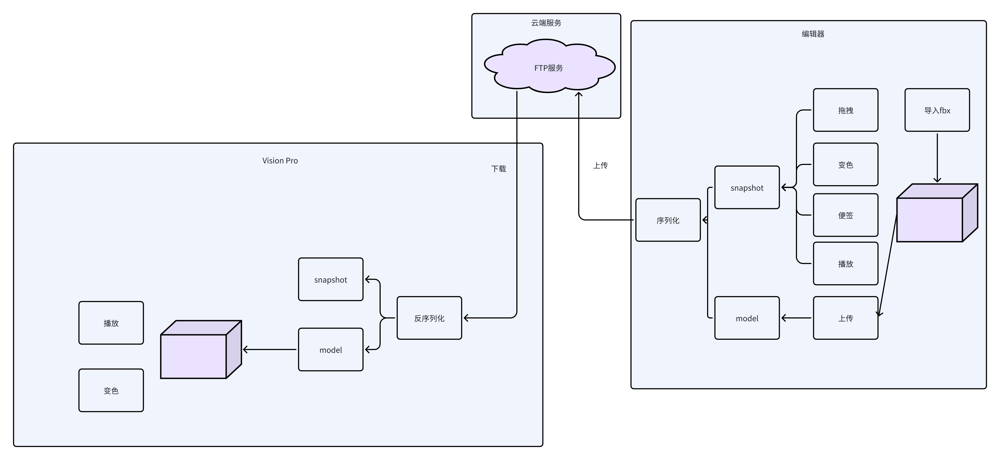

# MigSpace

[English README](README.md)



MigSpace 是一个受 JigSpace 启发的开源 3D 创作与演示项目。它将编辑工作流与演示工作流整合在同一个 Unity 工程中，目标平台包括 Windows、移动端和 Vision Pro。其中 Windows 和移动端支持编辑模式与演示模式，Vision Pro 当前主要面向演示模式。

## 演示视频

<video src="doc/video/mig_demo.mp4" controls width="720"></video>

## 项目简介

MigSpace 提供了协作式 3D 内容创建、编辑和展示的基础能力。目前项目仍在持续开发中，核心流程已经可用，其余功能仍在逐步完善。

## 环境要求

- Unity `2023.3.0f1` 或更高版本
- Git
- 可访问 `Packages/manifest.json` 中自定义包仓库的网络环境与权限

## 快速开始

### 1. 克隆仓库

```bash
git clone <your-repository-url>
cd MigSpace
```

### 2. 解析包依赖

当前项目通过 `Packages/manifest.json` 中的 Git URL 引用了多个自定义包，包括：

- `com.mig.core`
- `com.mig.model`
- `com.mig.presentation`

在使用 Unity 打开项目之前，请确保当前 Git 环境可以访问这些远程仓库。

### 3. 使用 Unity 打开项目

使用 Unity `2023.3.0f1` 或更高版本打开仓库，然后加载主场景：

`Assets/Scenes/ProjectView.unity`

## 配置说明

运行项目之前，请先更新以下文件中的 FTP 配置：

`Packages/mig.core/Mig.Core/Runtime/FTP/FTPClient.cs`

```csharp
private static string FTPCONSTR = "";
private static string FTPUSERNAME = "mig";
private static string FTPPASSWORD = "migassets";
```

请将这些值替换为你自己的 FTP 服务器地址和账号信息。

## 运行项目

当 Unity 完成项目导入后：

1. 打开 `Assets/Scenes/ProjectView.unity`
2. 确认 FTP 配置正确
3. 在 Unity 编辑器中点击 `Play`

## 构建说明

开始构建前，请确保以下两个场景已经加入 Unity 的 Build Settings：

- `Assets/Scenes/ProjectView.unity`
- `Assets/Scenes/MainScene.unity`

然后在 `Build Settings` 中选择目标平台，并执行正常的 Unity 构建流程。

## 项目结构



## 参与贡献

欢迎通过 Pull Request 参与贡献。推荐流程如下：

1. Fork 本仓库
2. 创建功能分支
3. 提交修改并发起 Pull Request

如果你有问题或合作意向，可以通过邮箱联系：[943264652@qq.com](mailto:943264652@qq.com)

## 许可证

本项目采用 MIT License，详情请参见 [`LICENSE`](LICENSE)。
