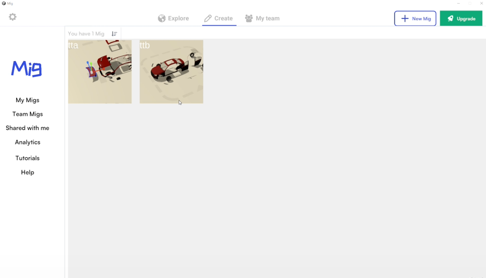

# MigSpace

[中文说明](README.CN.md)


MigSpace is an open-source 3D authoring and presentation project inspired by JigSpace. It combines editor workflows and presentation workflows in a single Unity project and targets Windows, mobile platforms, and Vision Pro. On Windows and mobile, both editor mode and presentation mode are available. On Vision Pro, the project currently focuses on presentation mode.



## Demo

<video src="doc/video/mig_demo.mp4" controls width="720"></video>

## Overview

MigSpace provides the foundation for creating, editing, and presenting 3D content collaboratively. The project is under active development, with the core workflow already available and additional features still being refined.

## Requirements

- Unity `2023.3.0f1` or later
- Git
- Network access and credentials for the package repositories referenced in `Packages/manifest.json`

## Getting Started

### 1. Clone the repository

```bash
git clone <your-repository-url>
cd MigSpace
```

### 2. Resolve package dependencies

This project currently references several custom packages through Git URLs in `Packages/manifest.json`, including:

- `com.mig.core`
- `com.mig.model`
- `com.mig.presentation`

Make sure your Git environment has access to the corresponding remote repositories before opening the project in Unity.

### 3. Open the project in Unity

Open the repository with Unity `2023.3.0f1` or newer, then load the main scene:

`Assets/Scenes/ProjectView.unity`

## Configuration

Before running the project, update the FTP configuration in:

`Packages/mig.core/Mig.Core/Runtime/FTP/FTPClient.cs`

```csharp
private static string FTPCONSTR = "";
private static string FTPUSERNAME = "mig";
private static string FTPPASSWORD = "migassets";
```

Replace these values with your own FTP server address and credentials.

## Run the Project

After the project finishes importing in Unity:

1. Open `Assets/Scenes/ProjectView.unity`.
2. Confirm the FTP configuration is correct.
3. Click `Play` in the Unity Editor.

## Build

Before creating a build, make sure both scenes below are included in Unity Build Settings:

- `Assets/Scenes/ProjectView.unity`
- `Assets/Scenes/MainScene.unity`

Then select the target platform in `Build Settings` and run a normal Unity build.

## Project Structure


## Contributing

Pull requests are welcome. If you would like to contribute:

1. Fork the repository.
2. Create a feature branch.
3. Submit a pull request with a clear description of your changes.

For questions or collaboration, contact [943264652@qq.com](mailto:943264652@qq.com) or [44198864@qq.com](mailto:44198864@qq.com).

## License

This project is licensed under the MIT License. See [`LICENSE`](LICENSE) for details.
